# Introduction

Welcome! My name is Benchun Zhou, I am going to show you some researches and projects during my graduate studies, if you want to know more details of these projects, please click the external link to see the PDFs, or contact me (benchunzhou@gmail.com or benchun123@buaa.edu.cn). I really appreciate your visit and suggestions, I hope you can get what you want. 

# Research Interests

*   Autonomous System
*   Motion Planning for Mobile Robots
*   UAV Navigation

# Overview
* End-to-end learning on Autonomous System
	* **`Master Thesis`** [Autonomous Navigation of UAV Using Deep Reinforcement Learning](#11-Master-Thesis-Autonomous-Navigation-of-UAV-Using-Deep-Reinforcement-Learning)
	* **`Project`**   	  [End-to-end Learning in Motion Planning for Robots](#12-Project-End-to-end-Learning-in-Motion-Planning-for-Robots)
	* **`Survey`**		  [Application of End-to-end Learning Method](#13-Survey-Application-of-End-to-end-Learning-Method)

*  Traditional Method on Autonomous System
	* **`Internship`** 	  [Autonomous Robotics Motion Planning](#21-Internship-Autonomous-Robotics-Motion-Planning)
	* **`Project`** 	  [Self-driving Car based on Model Predictive Control](#22-Project-Self-driving-Car-based-on-Model-Predictive-Control)
	* **`Survey`** 		  [Autonomous Driving Framework Using Traditional Method](#23-Survey-Autonomous-Driving-Framework-Using-Traditional-Method)
	* **`Review`** 		  [A Review of Motion Planning Techniques](#24-Review-A-Review-of-Motion-Planning-Techniques)

* Project in real world
	* **`Car Competition`**  [National Intelligent Car Contest for College Students](#31-Car-Competition-National-Intelligent-Car-Contest-for-College-Students)
	* **`Servo System`**  [High Precision Servo System](#32-Servo-System-High-Precision-Servo-System)
	* **`Mobile Robots`**  [Autonomous Robotics Motion Planning](#33-Mobile-Robots-Autonomous-Robotics-Motion-Planning)

* Control
	* **`Optimal Control`**  [Generalized Optimal Guidance Law with a Terminal Intercept Angle](#41-Optimal-Control-Generalized-Optimal-Guidance-Law-with-a-Terminal-Intercept-Angle)
	* **`Terminal Sliding Model`** 		  [Nonsingular Fast Terminal Sliding Mode Guidance Law with Impact Angle Constraints](#42-Terminal-Sliding-Model-Nonsingular-Fast-Terminal-Sliding-Mode-Guidance-Law-with-Impact-Angle-Constraints)
	* **`Model Predictive Control`** 		  [Self-driving Car based on Model Predictive Control](#43-Model-Predictive-Control-Self-driving-Car-based-on-Model-Predictive-Control)

# Project details
## 1. End-to-end learning on Autonomous System
### 1.1 `Master Thesis` [Autonomous Navigation of UAV Using Deep Reinforcement Learning](https://github.com/benchun123/phd/blob/master/P1_Autonomous%20Navigation%20Using%20Deep%20Reinforcement%20Learning.pdf)

Autonomous navigation of unmanned aerial vehicles (UAV) can be seen as a process that robots make a plan how to safely and quickly reach the target location. Traditional navigation methods rely heavily on environment information and manual design, making them difficult to adapt new environment. In the thesis, we aim to apply deep reinforcement learning (DRL) on autonomous navigation, learning optimal control policy through interaction with environment. 
The main work of the paper was shown as follows: 
1) Theoretical basis of deep reinforcement learning was given.
2) Vision-based autonomous navigation task using Deep Q-Network method was discussed. 
3) Deep Deterministic Policy Gradient was improved to solve the same problem, enabling the UAV to take depth image as input and act in continuous space. 
4) Simulations in AirSim supported the idea of autonomous navigation through DRL methods. 

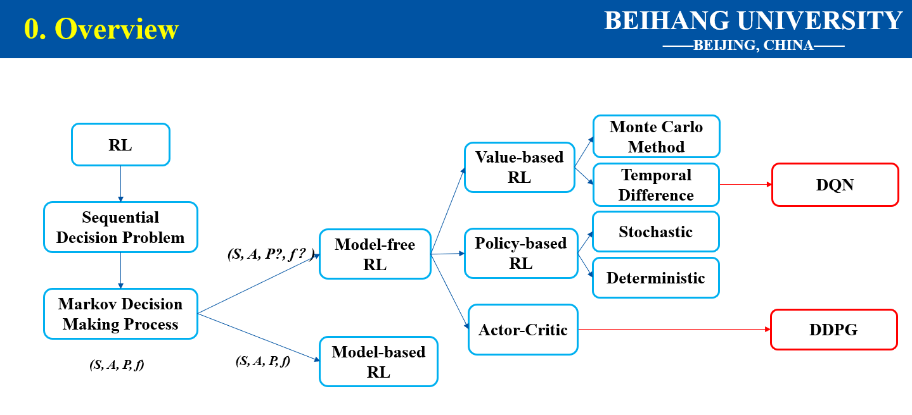
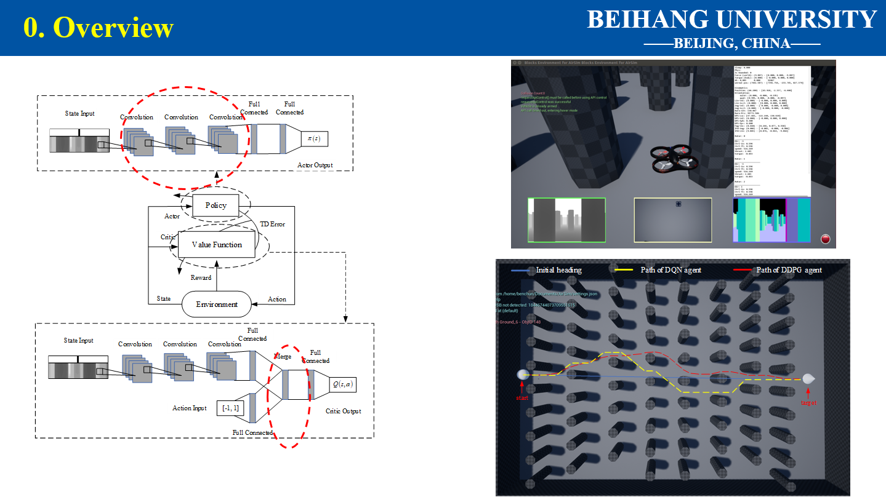

### 1.2 `Project` [End-to-end Learning in Motion Planning for Robots](https://github.com/benchun123/phd/blob/master/P2_End-to-end%20Learning%20in%20Motion%20Planning%20for%20Robots.pdf)

Learning from demonstration for motion planning is an ongoing research topic. In this project we present a model that is able to learn the complex mapping from raw 2D laser range findings and a target position to the required steering commands for the robot. This approach learns a target oriented end-to-end navigation model for a robotic platform Furthermore, the supervised model training is based on expert demonstrations generated in simulation with an existing motion planner. We demonstrate that the learned navigation model is directly transferable to previously unseen virtual environments. It can safely navigate the robot through obstacle-cluttered environments to reach the desired targets.

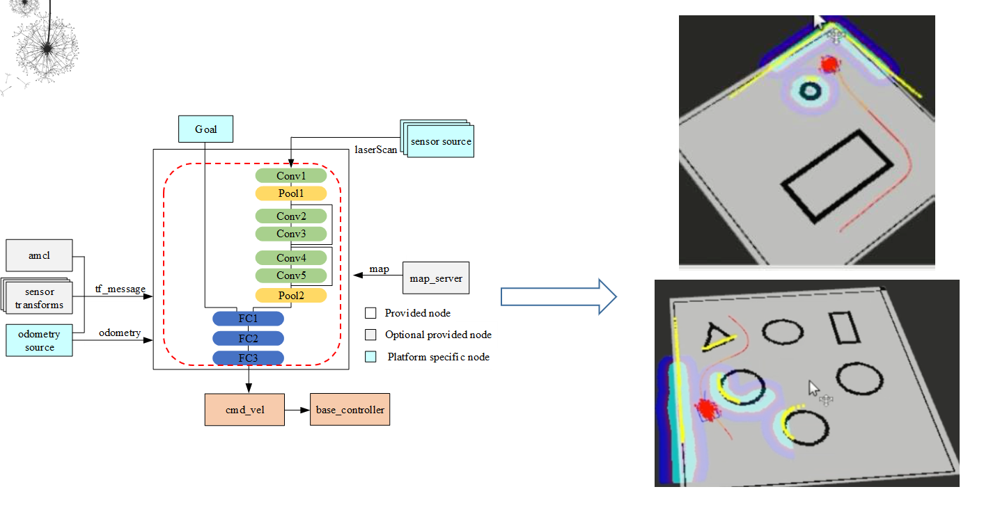

### 1.3 `Survey` [Application of End-to-end Learning Method](https://github.com/benchun123/phd/blob/master/P3_Application%20of%20End-to-End%20Learning.pdf)

End to end learning techniques have been widely applied, achieving state-of-the-art results in various fields of study. This survey focuses on end to end learning solutions that target learning control policies for various applications. In the presentation, we carry out our discussion on three kinds of applications: Autonomous Driving, Mobile Robots and UAV Navigation. In each of the field, we also divided the learning methods as three paradigms: Convolutional Neural Network, Recurrent Neural Network and Deep Reinforcement Learning

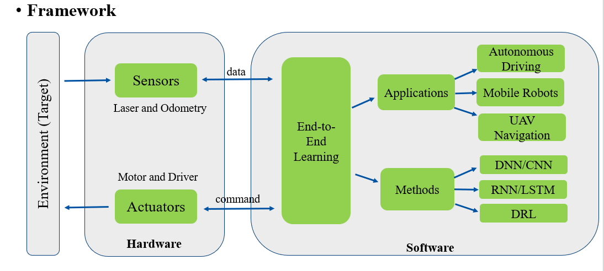

## 2. Traditional Method on Autonomous System
### 2.1 `Internship` [Autonomous Robotics Motion Planning](https://github.com/benchun123/phd/blob/master/P4_Autonomous%20Robotics%20Motion%20Planning.pdf)

I have an internship at Intel China Research Center Ltd (ICRC, Beijing, China), where I worked as an assistant intern supporting senior engineer to build the prototype of an autonomous robotics. In the project, I was responsible for planning and control modules, where I configured the planner to free path towards the goal and designed PID controller to follow the path. This unforgettable experience not only cultivated my engineering thinking about applications, but also taught me how to communicate and cooperate with colleagues.

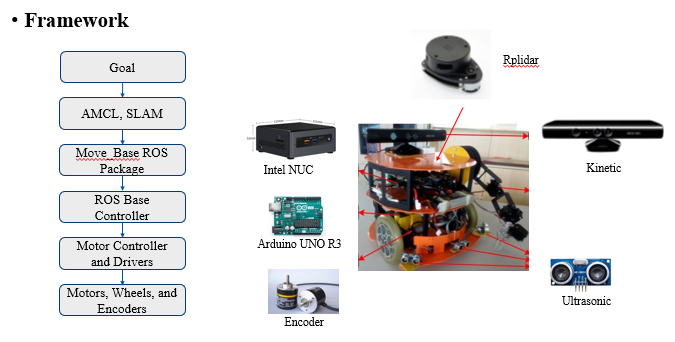

### 2.2 `Project` [Self-driving Car based on Model Predictive Control](https://github.com/benchun123/phd/blob/master/P5_Self-driving%20Car%20based%20on%20Model%20Predictive%20Control.pdf)

The aim of the project is to drive a car in a simulator by taking current state of car and new few way points and obtaining ideal throttle and steering values such that car is able to navigate without going off road. The idea is to use method of Model Predictive Car Control. In this we use the cars turning radius and create a model of car behavior for given set of actuations and then using this model obtain ideal values of actuations by defining a cost function. The cost function incorporates the cross track error, orientation error, target speed and values and changes in these values in actuation.

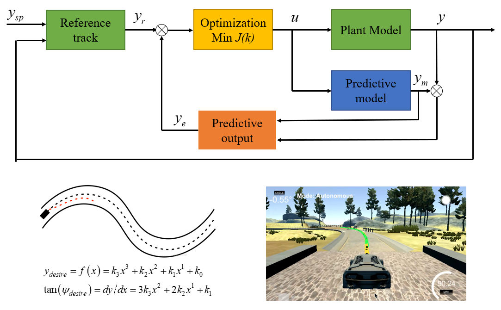

### 2.3 `Survey` [Autonomous Driving Framework Using Traditional Method](https://github.com/benchun123/phd/blob/master/P6_Autonomous%20Driving%20%20Framework%20Using%20Traditional%20Method.pdf)

Autonomous vehicles have been defined as ‘vehicles in which operation occurs without direct driver input to control the steering, acceleration and braking’.Key concepts of autonomous systems and internationally competitive technology modules have already been developed. It is important to develop these technological pioneers within the framework of a comprehensive reference architecture for autonomous systems. Generally speaking, an autonomous vehicle can be seen as a cognitive system with three modules: perception, planning and control, which will be reviewed in detail in the subsequent sections.
1) Serving as the sensorium of an autonomous vehicle, the perception module enables the vehicle to localize itself, recognize the object in surrounding environment and provide information to the path planning module.
2) Taking the available information, planning module focuses on generating a free path from start place towards target place, considering obstacle avoidance and trajectory optimization.
3) Autonomous vehicle control performs the necessary action to follow the intended trajectory generated by the path planner.

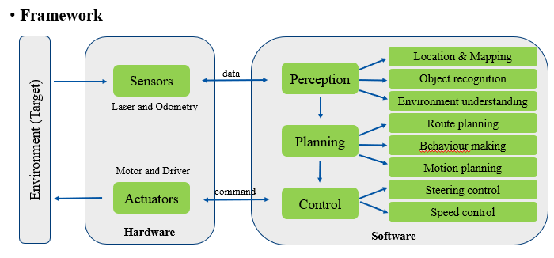

### 2.4 `Review` [A Review of Motion Planning Techniques](https://github.com/benchun123/phd/blob/master/P7_A%20Review%20of%20Motion%20Planning%20Techniques.pdf)

Motion planning breaks down a desired movement task into discrete motions that satisfy movement constraints and possibly optimizes some aspect of the movement. This planning technique is classified in five groups: 
1) Graph Search Based Planners traverse a state space to get from point A to point B, such as A star and State Lattice Algorithm. 
2) Sampling Based Planners consist on randomly sampling the configuration space or state space, looking for connectivity inside it, such as RRT and PRM. 
3) Interpolating Curve Planners take advantages of geometric relationship of a given set of way points, such as Bézier Curves and Spline Curves. 
4) Numerical Optimization aim to minimize or maximize a function subject to different constrained variables, 
5) Computational intelligent methods are a set of nature-inspired computational methodologies and approaches. It has been applied in the field of UAVs since it can yield effective, accurate and rapid solutions

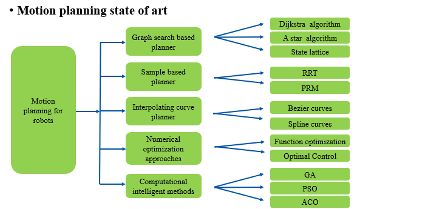

## 3. Projects in real world
### 3.1 `Car Competition` [National Intelligent Car Contest for College Students](https://github.com/benchun123/phd/blob/master/O1_National%20Intelligent%20Car%20Contest%20for%20College%20Students.pdf)

In the background of the 10th National Intelligent Car Contest for College Students, this article introduces the software and hardware structures and the development flow of the vehicle control system. This contest adopting A-type car model prescribed by the contest organization committee, using the 32-bit MCU K60 produced by Freescale Semiconductor Company as the core controller, requires the car finish the race in the fastest speed. The whole system includes the aspects of the mechanism structure adjustment, the sensor circuit design and signal process, control algorithm and strategy optimization etc. It captures the road information through resonant circuit, then abstracts the road position. After that, PD feedback control is used on the steering. At the same time, the system obtains the current speed using a speed sensor, so that it can realize the feedback control of the speed by PID method.

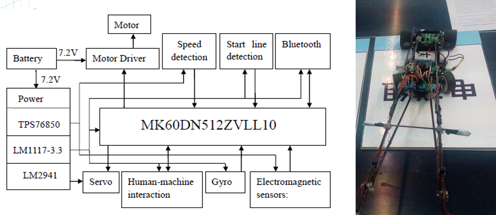

### 3.2 `Servo System` [High Precision Servo System](https://github.com/benchun123/phd/blob/master/O2_High%20Precision%20Servo%20System.pdf)

Simulation turntable is a typical high-performance servo system. three axis turntable simulated various fight movement and postures of aircraft and missile in the air based on different motions of the three axis. It is the key and high-performance equipment to carry on a semi-physical simulation on the ground during the development process of aircraft and missiles, and is very important to the development of flight control and guidance weapons. The main work of this project was: 
1) Worked as a full-stack engineer designing and debugging software of the system which was required to have a high positional accuracy (±1'') and velocity index (accuracy: ±0.002%, fluctuation: ±0.002%).
2) Modeled the object as a second-order transfer function through the Amplitude and Frequency Characteristics which can be acquired by adding white noise.
3) Designed control algorithm (PID + DOB + ZPETC) to overcome the noise caused by friction and ensured the dynamic characteristic meet the requirement.

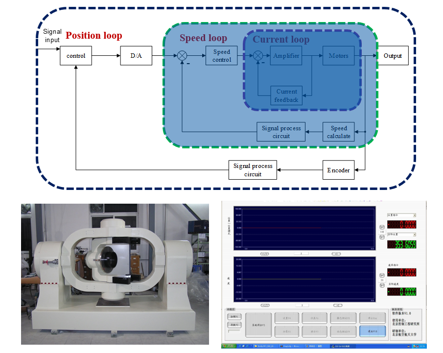

### 3.3 `Mobile Robots` [Autonomous Robotics Motion Planning](https://github.com/benchun123/phd/blob/master/P4_Autonomous%20Robotics%20Motion%20Planning.pdf)

This document presents the work done in the laboratory sessions as well as the final project corresponding to the subject: Robot Control System. These sessions concern the use and implementation of algorithms related to Mobile Robotics using the TurtleBot and the ROS (Robotics Operating System), which also contributes to my internship. To be specific, we realize the function of Simultaneous Location and Mapping (SLAM), Autonomous Navigation and Obstacle Avoidance. 

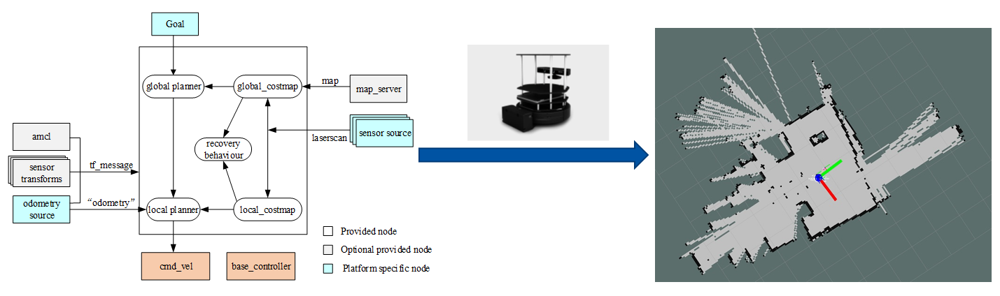

## 4. Control
### 4.1 `Optimal Control` [Generalized Optimal Guidance Law with a Terminal Intercept Angle](https://github.com/benchun123/phd/blob/master/O3_Generalized%20Optimal%20Guidance%20Law%20with%20a%20Terminal%20Intercept%20Angle.pdf)

The intercept angle frame is defined which axis is in the direction of  desired impact angle, and the engagement kinematics is established in the interception angle frame. Generalized weight optimal guidance laws with interception angle constraints are studied for lag-free control systems. For the systems with elementary function weighting, the analytical forms of weighted optimal guidance laws can be obtained if the integrations of the inverse of the weighting function up to triple can be analytical given. The results can applied to guidance law designs for accomplishing different guidance objectives. For some specific weighted function, the proposed guidance law has extended the results in references. 

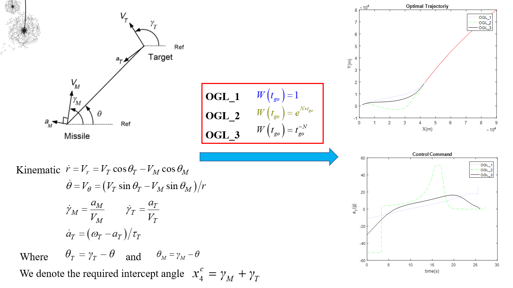

### 4.2 `Terminal Sliding Model` [Nonsingular Fast Terminal Sliding Mode Guidance Law with Impact Angle Constraints](https://github.com/benchun123/phd/blob/master/O4_An%2BImproved%2BNonsingular%2BFast%2BTerminal...Benchun%20Zhou.pdf)

In the paper, an improved nonsingular fast terminal sliding mode (INFTSM) guidance law with impact angle constraints is proposed. The guidance law, which employs a double power reaching law and an attractor with negative exponential factor, has a fast speed no matter far from the sliding surface or approach. For the maneuvering targets, extended state observer is designed through which the unknown lateral acceleration of target can be estimated and contributed to make compensation for the motion. Compared with other nonsingular guidance law, the proposed INFTSM guidance law not only has a better performance in impact angle and miss distance, but also show advantage in shorter time and higher accuracy. Numerical simulation results are presented to illustrate the proposed guidance law. 

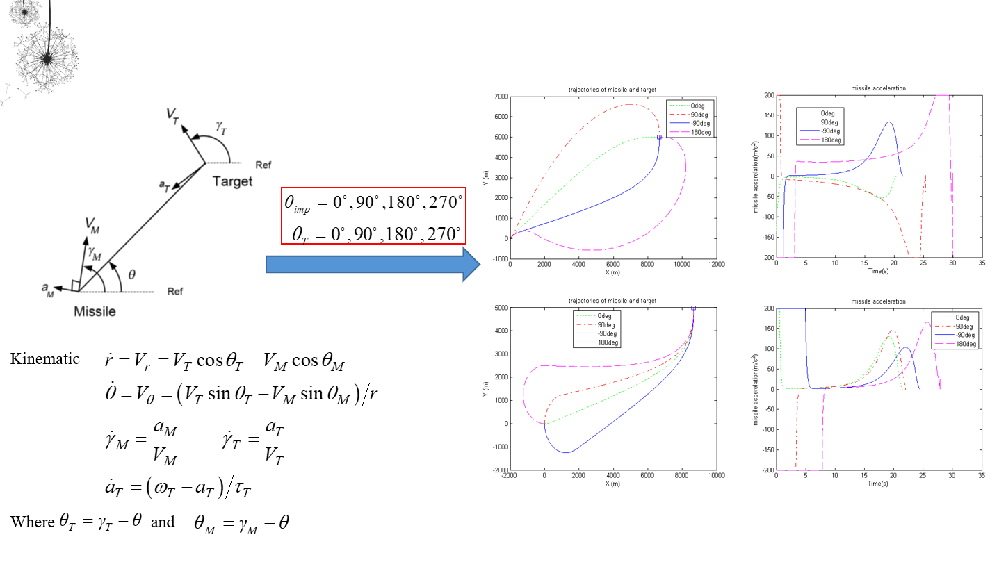

### 4.3 `Model Predictive Control` [Self-driving Car based on Model Predictive Control](https://github.com/benchun123/phd/blob/master/P5_Self-driving%20Car%20based%20on%20Model%20Predictive%20Control.pdf)

Model predictive controllers rely on dynamic models of the process. The main advantage of MPC is the fact that it allows the current timeslot to be optimized, while keeping future timeslots in account. This is achieved by optimizing a finite time-horizon, but only implementing the current timeslot. MPC has the ability to anticipate future events and can take control actions accordingly. In this project, we solved path tracking problems using model predictive controller which consists of prediction, optimization and feedback control.

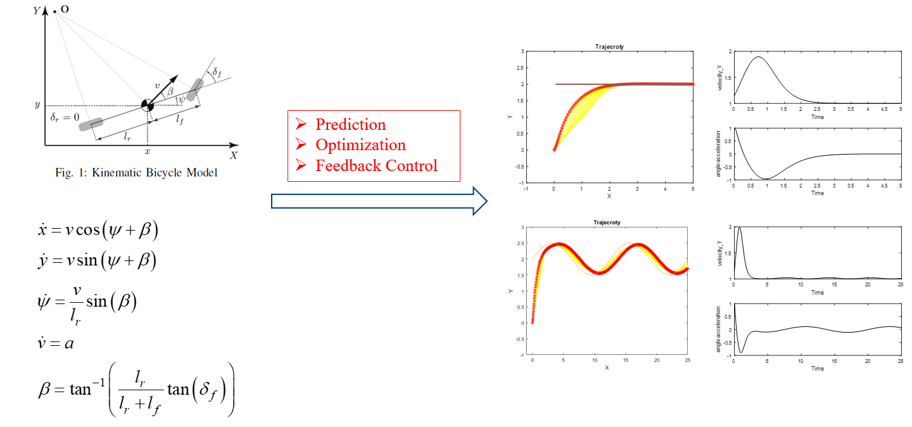

# Bibliography

## Myself
* [Bibliography about Autonomous Driving](https://github.com/benchun123/phd/blob/master/Bibliography%20about%20Autonomous%20Driving.md)
* [Bibliography about UAV Navigation](https://github.com/benchun123/phd/blob/master/Bibliography%20about%20UAV%20Navigation.md)
* [Bibliography about Robotics Motion planning]

* [Bibliography about Deep Reinforcement Learning](https://github.com/benchun123/phd/blob/master/Bibliography%20about%20Deep%20Reinforcement%20Learning.md)
* [Bibliography about Traditional Planning Method]

## Other biblography
* [Key Papers in Deep RL from OpenAI](https://github.com/benchun123/phd/blob/master/Key%20Papers%20in%20Deep%20RL%20from%20OpenAI.rst#a-model-is-learned)
* [Key Labs in Motion Planning from Zhihu](https://github.com/benchun123/phd/blob/master/Key%20Labs%20in%20Motion%20Planning%20from%20Zhihu.rst)
* [Materials about Autonomous Driving from Zhihu](https://github.com/benchun123/phd/blob/master/Materials%20about%20Autonomous%20Driving%20from%20Zhihu.rst)

